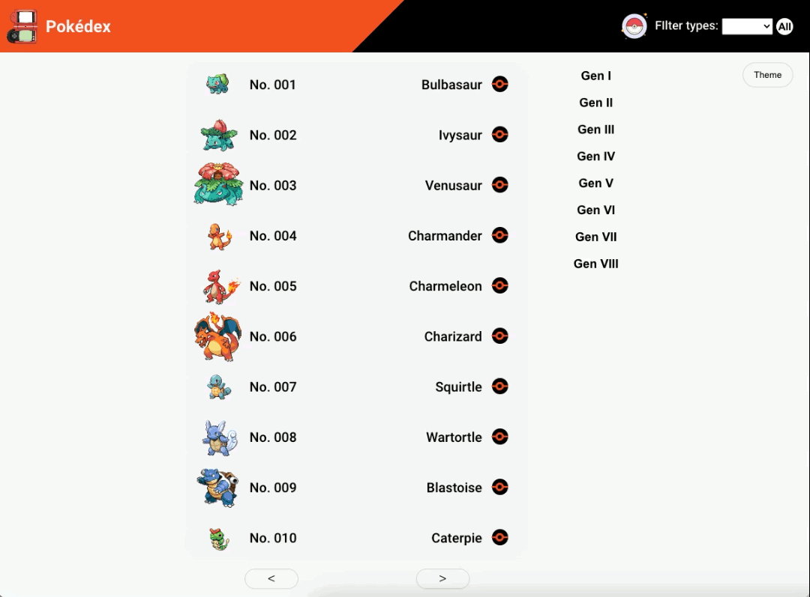
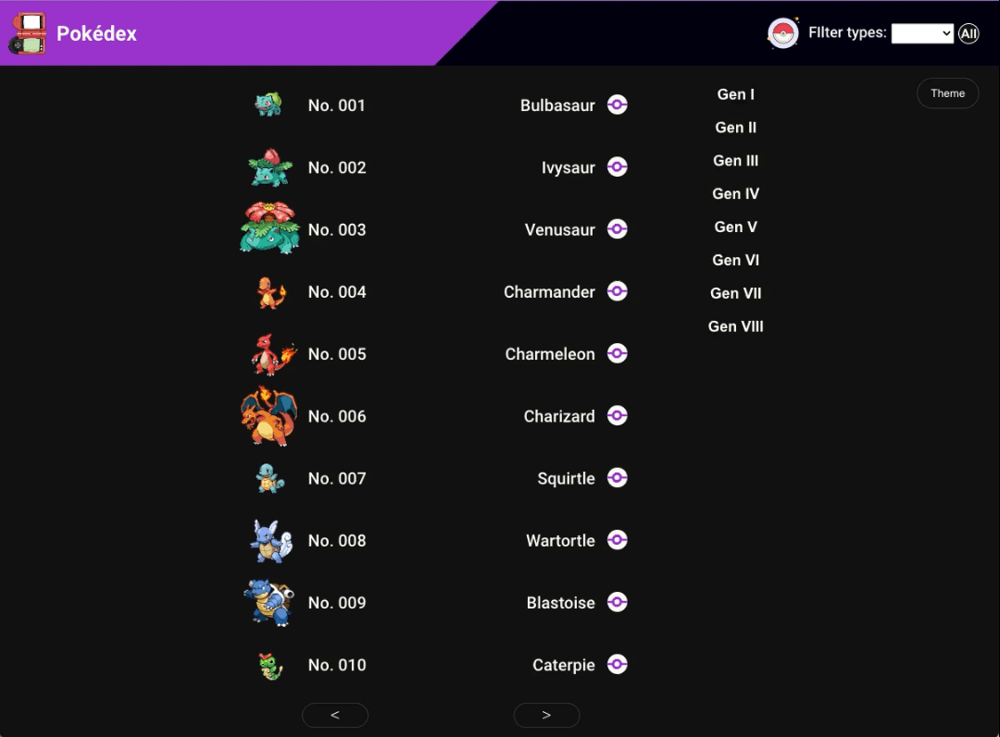

# Pokédex Poké Api

# Indice
#### 1. Descrição da aplicação
#### 2.  Descrição das funcionalidades 
#### 3. Ferramentas utilizadas
#### 4.  Justificativa do design do projeto
#### 5.  Como baixar/clonar e rodar o projeto

## 1.	Descrição da aplicação: 
A aplicação tem a finalidade de exibir uma lista de 10 Pokémon por página, com sua imagem, número e nome, com um total de 1124 Pokémon. 

Ao clicar em algum Pokémon da lista, o usuário será redirecionado para uma página com a arte oficial do Pokémon, e outras informações como o tipo, habilidades e movimentos.

A aplicação é responsiva, e funciona bem em todos os tamanhos de tela.

## 2.	Descrição das funcionalidades
A aplicação possui um filtro de tipos que lista e exibe apenas Pokémon com aquele tipo em especifico. 

Possui botões que servem para passar e voltar a lista, nesse caso sempre exibindo 10 Pokémon. Possui botões que levam o usuário para o começo da lista de cada geração lançada nos Pokémon (exemplo: 1 º geração; do Pokémon 1 ao 151, 2º geração; do Pokémon 152 ao 251 e etc.). E um botão que seleciona um tema claro ou escuro, que fica salvo no localStorage, quando o usuário abrir a aplicação o último tema definido vai ser inicializado junto com a aplicação.

## 3.	Ferramentas utilizadas
Javascript juntamente com o React. O React foi utilizado porque era preciso criar uma aplicação de página únic, SPA (single page application). O Fetch foi utilizado para fazer as requisições da REST Api (Poké Api).Context Api foi utilizado para definir as cores dos temas e também para conseguir acessar todo esse conteúdo em qualquer lugar da minha aplicação. Styled component foi utilizado para estilizar grande parte dos componentes da aplicação.
## 4.	Justificativa do design do projeto
A aplicação foi pensada para mostrar uma lista relativamente curta para que caiba em qualquer dispositivo de celular, tablet ou desktop. Mostrando apenas uma lista com 10 Pokémon por vez o usuário não precisa rolar a página inteira de volta para conseguir usar o filtro de tipos, ou mudar o tema. Outro motivo foi tentar aproximar a aplicação de uma Pokédex baseada nos jogos, animes e manga, como se fosse um dispositivo parecido com um celular ou tablet. 
## 5.	Como baixar/clonar e rodar o projeto
1.	Clonar ou baixar o código do repositório
2.	Abrir o projeto dentro do Visual Studio Code (Vs Code)
3.	Instalar os pacotes utilizados no projeto no terminal com “npm install”
4.	Inicializar o projeto com o “npm start” no terminal

